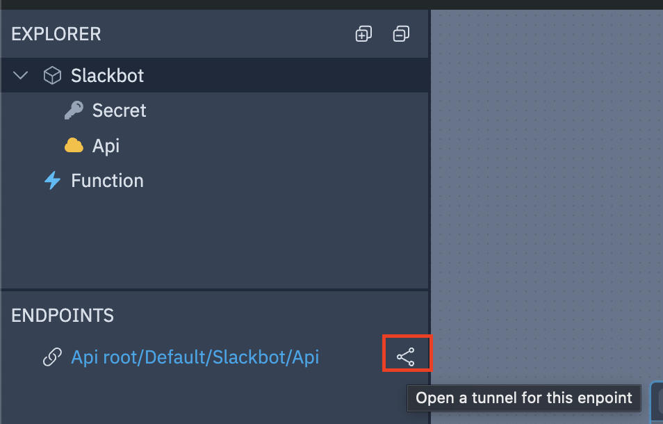

# slack

This library allows using Slack with Wing.

## Prerequisites

* [winglang](https://winglang.io)

## Installation

Use `npm` to install this library:

```sh
npm i @winglibs/slack
```
## Bring it

```js
bring slack;
bring cloud;

let myBotToken = new cloud.Secret(name: "mybot_token");

let slackbot = new slack.App(botToken: myBotToken);

slackbot.onEvent("app_mention", inflight (ctx, event) => {
  let message = new slack.Message();
  message.addSection({
    fields: [
      {
        type: slack.FieldType.mrkdwn,
        text: "*Wow this is markdown!!*\ncool beans!!!"
      }
    ]
  });

  ctx.channel.postMessage(message);
});
```

### Create your Slack App

1. Go to the [Slack API Dashboard](https://api.slack.com/apps) and create a new app.
2. Select **Create from Scratch**.
3. For the README example above, ensure you provide the following permissions:
  - `app_mentions:read`
  - `chat:write`
  - `chat:write.public`
  - `channels:read`
4. Navigate to **Events** and subscribe to the following events:
  - `app_mention`
5. Navigate to **OAuth & Permissions** and install the app to your workspace
6. Copy the **Bot User OAuth Token** to your clipboard
7. Navigate to **Event Subscriptions** and enable events, then subscribe to bot events:
  - `app_mention`

### Running in the Wing Simulator

First lets configure our Slack bot token as a secret in the simulator. 

```sh
wing secrets
```

When prompted, paste the Bot User OAuth Token you copied earlier.

Next when running in the Wing Simulator, you will need to expose the endpoint of the Slackbot API, this can be done through the simulator console by selecting `Open tunnel for this endpoint` 



Take this URL and navigate back to your Slack App, under the Event Subscriptions section, paste the URL into the Request URL field and append `/slack/events` to the end of the URL. 

### Running in AWS

First lets configure our Slack bot token as a secret in AWS. 

```sh
wing secrets -t tf-aws
```

When prompted, paste the Bot User OAuth Token you copied earlier.

Next lets run the following command to deploy our app to AWS.

```sh
wing compile -t tf-aws
terraform -chdir=target/main.tfaws init
terraform -chdir=target/main.tfaws apply
```


After compiling and deploying your app using `tf-aws` you there will be an endpoint called `Slack_Request_Url` that is part of the terraform output. The URL should end with `/slack/events`. It will look somehting like this:

```sh
Apply complete! Resources: 11 added, 0 changed, 0 destroyed.

Outputs:

App_Api_Endpoint_Url_E233F0E8 = "https://zgl8r8wsng.execute-api.us-east-1.amazonaws.com/prod"
App_Slack_Request_Url_FF26641D = "https://zgl8r8wsng.execute-api.us-east-1.amazonaws.com/prod/slack/events"
```

Navigate back to your Slack App, under the Event Subscriptions section, paste the URL into the Request URL field and append `/slack/events` to the end of the URL.


## Post Directly to a Channel

If you want to post directly to a channel, you can do so by using the following code:

```js
bring slack;
bring cloud;

let slackbot = new slack.Slackbot();

let postMessage = new cloud.Function(inflight () => {
  let channel = slackbot.getChannel("C072T52EZ3Q");

  channel.postText("hello world!");
});
```